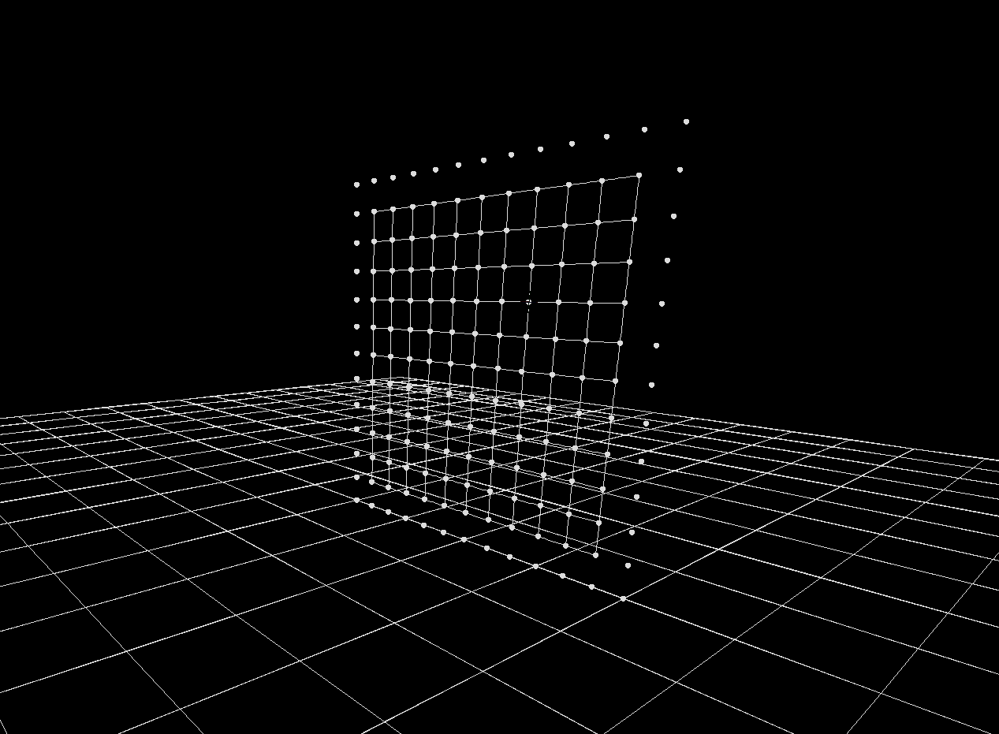
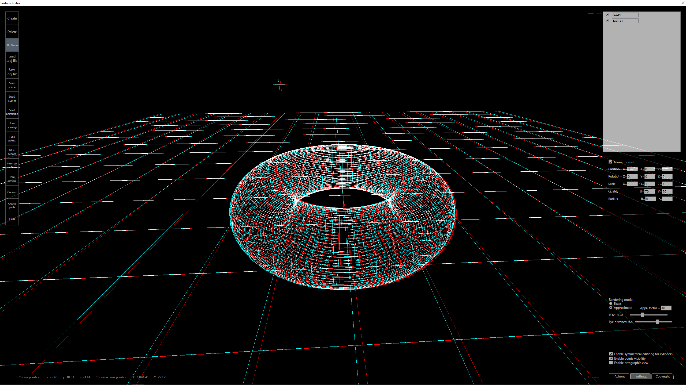

# Surface Edior

Surface Editor is a 3D editor for creating and editing models based on patches and curves. It was created as part of the 3D modeling master course on WUT in 2019. The software allows for the creation of a complete model that can then be machined on a 3-axis CNC machine.

    

    

It contains the following features:
- rendering of the curves, patches, and surfaces based on parametric representation,

    

- editing Bezier and B-Spline curves and patches based on control points manipulation,

    

- 3D cursor for single and multiple points manipulation,
- stereoscopic view,

    

- saving and loading scene,
- filling of surfaces,
- finding surfaces intersections,

    

    

- trimming surfaces based on intersection curves,

    

- path generation for 3-axis CNC machining,
- information and editing convenience features.
## Technologies

- C#
- .Net Framework 4.7.1
    - WPF .NET
    - [MathNet.Numerics](https://numerics.mathdotnet.com/)
    - [Newtonsoft.Json](https://www.newtonsoft.com/json)
    - [WriteableBitmapEx](https://github.com/reneschulte/WriteableBitmapEx)

## Usage

To use the software open 'Surface Editor.sln' with Visual Studio. Then build and run the solution.

## Notes

The F1 key inside the editor displays possible actions and key bindings.